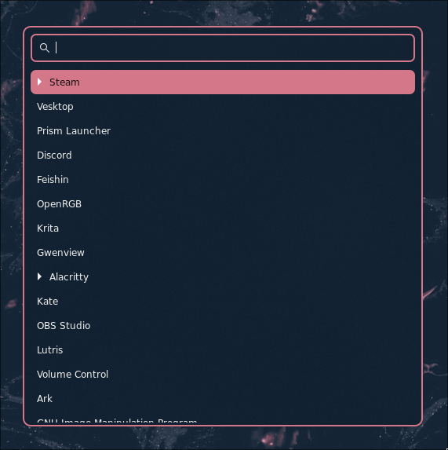

# nixos-config
This is my personal NixOS config that I use on my main PC. I use this configuration as my daily driver on my main PC running NixOS and it has been my main way of teaching myself functional programming and the Nix programming language.
This configuration uses flakes and Home-Manager, and is designed for both aesthetics and functionality.

## Components
| Component           | Name                                                                          |
| ------------------- | ----------------------------------------------------------------------------- |
| Window Manager      | [MangoWM](https://github.com/mangowm/mango)                                   |
| Status Bar          | [Waybar](https://github.com/Alexays/Waybar)                                   |
| File Manager        | [Dolphin](https://github.com/KDE/dolphin)                                     |
| Editor              | [Neovim](https://neovim.io/)                                                  |
| Terminal            | [Konsole](https://github.com/KDE/konsole)                                     |
| Shell               | [Zsh](https://www.zsh.org/) + [Oh My Zsh](https://github.com/ohmyzsh/ohmyzsh) |
| Resource Monitor    | [btop](https://github.com/aristocratos/btop)                                  |
| Web Browser         | [Zen](https://github.com/zen-browser/desktop)                                 |
| Launcher            | [Wofi](https://github.com/SimplyCEO/wofi)                                     |
| Notification Daemon | [Dunst](https://github.com/dunst-project/dunst)                               |
| Boot                | [Systemd-Boot](https://github.com/systemd/systemd)                            |

## Screenshots

## To Do List
- Rewrite for multiple hosts
- Add non-Nix user assets/dotfiles and their /home symlinks
- Declaratively install Zen browser with a set of extensions and settings
- Definitely much more that I'm not remembering at the moment
