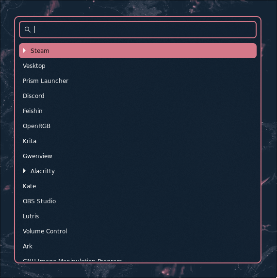

> [!WARNING]
> Do NOT use any configurations in this flake without modifying it to use on your own machine or your system may become unbootable

# nixos-config
This is my personal multiple-host NixOS flake config that I currently use for three different machines. It has a heavy focus on aesthitics while still keeping everything functional.

## Hosts
| Host                               | Platform      |
| ---------------------------------- | ------------- |
| nixos-pc                           | x86_64-linux  |
| nixos-laptop                       | x86_64-linux  |
| nixos-macbook                      | aarch64-linux |
| nixos-server                       | x86_64-linux  |

Credit to [nixos-apple-silicon](https://github.com/nix-community/nixos-apple-silicon/) for providing resources for using NixOS on ARM-based Macs

## Components
| Component           | Name                                                                          |
| ------------------- | ----------------------------------------------------------------------------- |
| Window Manager      | [MangoWM](https://github.com/mangowm/mango)                                   |
| Status Bar          | [Waybar](https://github.com/Alexays/Waybar)                                   |
| File Manager        | [Dolphin](https://github.com/KDE/dolphin)                                     |
| Editor              | [Neovim](https://neovim.io/)                                                  |
| Terminal            | [Konsole](https://github.com/KDE/konsole)                                     |
| Shell               | [Zsh](https://www.zsh.org/) + [Oh My Zsh](https://github.com/ohmyzsh/ohmyzsh) |
| Resource Monitor    | [btop](https://github.com/aristocratos/btop)                                  |
| Web Browser         | [Zen](https://github.com/zen-browser/desktop)                                 |
| Launcher            | [Wofi](https://github.com/SimplyCEO/wofi)                                     |
| Notification Daemon | [Dunst](https://github.com/dunst-project/dunst)                               |
| Boot                | [Systemd-Boot](https://github.com/systemd/systemd)                            |

## Screenshots

## To Do List
- ~~Restructure for multiple hosts~~
- ~~Add configuration for host "nixos-server"~~
- Set up game servers and file hosting for "nixos-server"
- Declaratively install Zen browser with a set of extensions and settings
- Write a more extensive Nixvim configuration
- Convert dotfiles to native Nix where possible
- Cleanup and reorganizing
